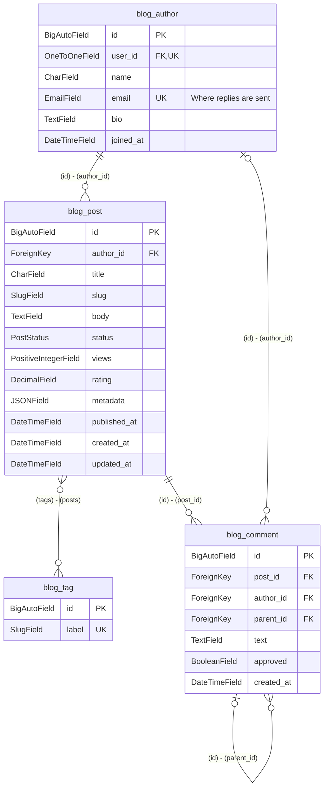

```mermaid
erDiagram
    blog_author ||--o{ blog_post : "(id) - (author_id)"
    blog_post }o--o{ blog_tag : "(tags) - (posts)"
    blog_post ||--o{ blog_comment : "(id) - (post_id)"
    blog_author |o--o{ blog_comment : "(id) - (author_id)"
    blog_comment |o--o{ blog_comment : "(id) - (parent_id)"
    blog_author {
        BigAutoField id PK
        OneToOneField user_id FK, UK
        CharField name
        EmailField email UK "Where replies are sent"
        TextField bio
        DateTimeField joined_at
    }
    blog_tag {
        BigAutoField id PK
        SlugField label UK
    }
    blog_post {
        BigAutoField id PK
        ForeignKey author_id FK
        CharField title
        SlugField slug
        TextField body
        PostStatus status
        PositiveIntegerField views
        DecimalField rating
        JSONField metadata
        DateTimeField published_at
        DateTimeField created_at
        DateTimeField updated_at
    }
    blog_comment {
        BigAutoField id PK
        ForeignKey post_id FK
        ForeignKey author_id FK
        ForeignKey parent_id FK
        TextField text
        BooleanField approved
        DateTimeField created_at
    }
```
